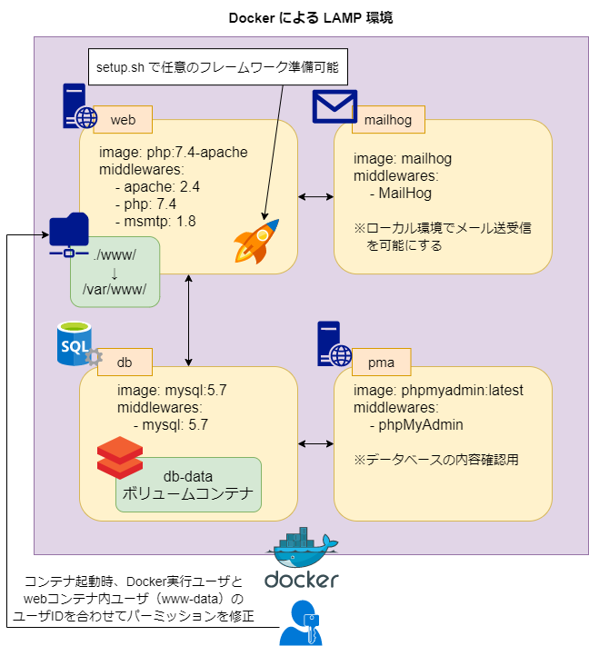

# docker-lamp

LAMP 基本構成 Docker テンプレート




## Environment

- OS:
    - Windows 10: Ubuntu 20.04 on WSL2
    - Ubuntu 18.04
- Docker: `19.03.8`
    - docker-compose: `1.24.0`

### 構成
```bash
./
|_ 00-nginx-proxy/ # ローカルロードバランサ用 Nginx
|                  ## 基本的に全ての docker 開発環境（本プロジェクト以外含む）で使用されるため、
|                  ## 別起動することを推奨（docker service 起動時に自動起動する）
|                  ## http, https ポート（80, 443）を占有するため注意
|_ docker/ # dockerコンテナ設定
|   |_ db/ # dbコンテナ（MySQLサーバ）設定
|   |   |_ dump/ # dumpファイルを ホスト <=> コンテナ間でやりとりするためのプロジェクトディレクトリ
|   |   |_ initdb.d/ # 初回投入データ格納
|   |   |_ Dockerfile # ビルド設定
|   |   |_ my.cnf # MySQL設定ファイル => docker://db:/etc/mysql/conf.d/my.cnf
|   |
|   |_ postfix/ # postfixコンテナ設定
|   |
|   |_ web/ # webコンテナ（本体サイトサーバ）設定
|       |_ conf/
|       |   |_ 000-default.conf # VirtualHost設定ファイル => docker://web:/etc/apache2/sites-available/000-default.conf
|       |   |_ php.ini # PHP設定 => docker://web:/usr/local/etc/php/php.ini
|       |
|       |_ Dockerfile # ビルド設定
|
|_ www/ # www-data ホームディレクトリ => docker://web:/var/www/
|   |_ app/ # プロジェクトディレクトリ
|   |   |_ public/ # DocumentRoot
|   |_ .msmtprc # msmtp (smtp 送信専用 MTA) 設定ファイル
|   |_ setup.sh # プロジェクト準備スクリプト（startup.sh から呼び出される）
|   |_ startup.sh # webコンテナ起動時に実行されるスクリプト
|
|_ docker-compose.yml # Dockerコンテナ構成
    # - volume://db-data: データベース永続化用ボリューム => docker://db:/var/lib/mysql
    # - docker://web/ <php:7.2-apache>
    #     - メインWEBサーバ
    #     - http://localhost:87400 = https://web.localhost => /var/www/app/
    # - docker://mailhog/ <mailhog/mailhog>
    #     - ローカル動作確認用SMTPサーバ + Web UI
    #     - http://localhost:87401 = https://mail.web.localhost => docker://mailhog:8025
    # - docker://db <mysql:5.7>
    #     - MySQL database server
    # - docker://pma <phpmyadmin/phpmyadmin>
    #     - MySQL GUI admin panel
    #     - http://localhost:87403 = https://pma.web.localhost => docker://pma:80
    # - docker://postfix/ <catatnight/postfix>
    #     - MTA + ローカルSMTPサーバ
    #     - 外部にメール送信する場合は、外部SMTPサーバにリレーする必要がある
    #         - $RELAY_SMTP_HOST: 外部SMTPサーバホスト環境変数
    #         - $RELAY_SMTP_PORT: 外部SMTPサーバポート環境変数
    #         - $RELAY_SMTP_USER: 外部SMTPサーバ接続ユーザ環境変数
    #         - $RELAY_SMTP_PASSWORD: 外部SMTPサーバ接続パスワード環境変数
```

### Setup
```bash
# ./www/ (docker://web:/var/www) の所有権を docker 実行ユーザに合わせたい場合は環境変数 UID を export する
$ export UID

# postfix コンテナは自サーバで SMTP サーバを立てる必要がある場合のみ立ち上げればよい
# また pma, mailhog コンテナは開発時のみ立ち上げればよい
# そのため、必要なければ web, db コンテナのみ起動する
## -d オプションでバックグラウンド起動できる
## Dockerfile の設定を変えてリビルドしたい場合は --build オプションをつける

# 開発時は web, mailhog, db, pma コンテナを起動する
$ docker-compose up -d web mailhog db pma

# ※全てのコンテナを起動する場合は docker-compose up -d
```

- WEBサーバ: http://localhost:87400 = https://web.localhost
    - `./www/app/public/index.php` 表示
- mailhog Web UI: http://localhost:87401 = https://mail.web.localhost
    - メールを外部 SMTP サーバを通して実際に送信したい場合は `./www/.msmtprc` を編集
    - もしくは postfix コンテナを立ち上げて、さらに外部 SMTP サーバにリレーすることもできる
- phpMyAdmin UI: http://localhost:87403 = https://pma.web.localhost

#### PHPフレームワークを使いたい場合
Laravel や WordPress といったフレームワークを利用したい場合 [./www/setup.sh](./www/setup.sh) を編集することで、コンテナ起動時にテンプレートを準備することができる

`setup.sh` は [./www/startup.sh](./www/startup.sh) から呼び出されるが、`startup.sh` はコンテナビルド時ではなく起動時に毎回実行されるため、[./www/app/](./www/app/) ディレクトリが存在しない場合のみ `setup.sh` を実行する構成となっている

```bash
# setup.sh

# 例: Laravel を準備する場合
composer create-project laravel/laravel ./app

# 例: WordPress を準備する場合
mkdir -p ./app/public/
wget -O - https://ja.wordpress.org/wordpress-latest-ja.tar.gz | tar xzvf - --strip-components 1 -C ./app/public
```
