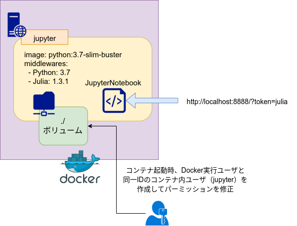

# JupyterNotebook + Julia

## Environment

- OS: Ubuntu 18.04
- Docker: 19.03.5
    - DockerCompose: 1.24.0

***

## Docker

### Structure
```bash
./ # カレントディレクトリ = 作業ディレクトリ
|_ jupyter/ # jupyterコンテナビルド設定
|   |_ Dockerfile # ビルド設定ファイル
|   |_ jupyter_notebook_config.py # JupyterNotebook設定ファイル
|
|_ docker-compose.yml # jupyterコンテナ: python:3.7-slim-buster | http://localhost:8888
                      ## JupyterNotebook + Julia 1.3.1 を同梱
```



### Usage
```bash
# jupyterコンテナ内の作業ユーザ（jupyter）とDocker実行ユーザのUIDを合わせてコンテナビルド
$ export UID && docker-compose build

# コンテナをバックグラウンドで起動
$ export UID && docker-compose up -d
```

コンテナが起動したら http://localhost:8888/?token=julia にアクセスすると JupyterNotebook が使える
