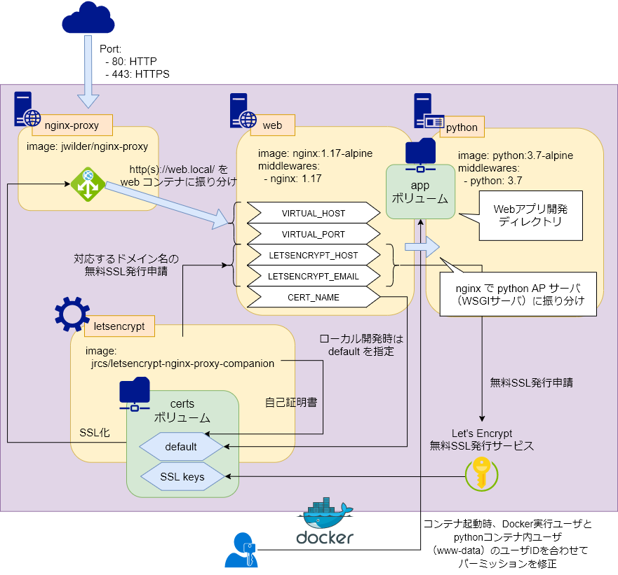

# Python + Nginx サーバ最小構成

## Environment

- OS: Ubuntu 18.04
- Docker: 19.03.5
    - DockerCompose: 1.24.0

***

## Docker

### Structure
```bash
./
|_ app/ # 作業ディレクトリ => docker://web,python:/var/www/app/
|   |_ vassals/  # uWSGI設定ファイル格納ディレクトリ
|   |   |_ server.ini # server.py 用の uWSGI 設定ファイル: docker://python:3000
|   |
|   |_ static/   # 静的ファイル配信用ディレクトリ
|   |_ server.py # WSGIサーバ
|
|_ docker/ # Dockerコンテナ設定
|   |_ certs/  # SSL証明書格納ディレクトリ
|   |_ python/ # pythonコンテナ
|   |   |_ Dockerfile
|   |   |_ requirements.txt # 必要なpythonライブラリを記述
|   |
|   |_ web/    # webコンテナ: https://web.local/ => docker://web:80
|       |_ Dockerfile
|       |_ nginx.conf # Nginx設定ファイル
|                     ## docker://web:80/static/ => /var/www/app/static/
|                     ## docker://web:80/ => docker://python:3000
|_ docker-compose.yml
```



### Usage
```bash
# Docker実行ユーザIDを合わせてDockerコンテナビルド
$ export UID && docker-compose build

# コンテナ起動
$ export UID && docker-compose up -d

## => https://web.local/ でサーバ稼働
```
