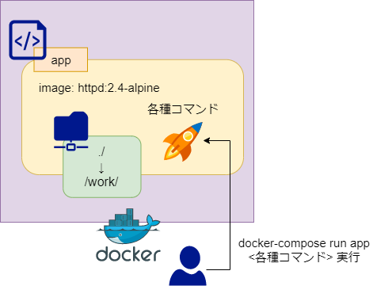

# サーバユーティリティ Docker環境

Docker + Nginx で手っ取り早く WEB サーバを構築するためのユーティリティツール

## Environment

- OS: Ubuntu 20.04
- Docker: 19.03.12
    - DockerCompose: 1.24.0

***

## Docker

### Structure
```bash
./ # 作業ディレクトリ => docker://app:/work/ にマウント
|_ lego/ # lego による Let's Encrypt SSL 証明書格納ディレクトリ
|   |_ webroot/ # lego http-01 認証用 webroot
|
|_ tools/ # 各種ユーティリティツール
|   |_ nginx.conf.go # nginx 設定ファイル自動生成ツール
|   |_ nginx.conf.gtpl # nginx 設定ファイルテンプレート
|
|_ .env # 環境変数定義用: gitignore するのが望ましい
|_ setup # セットアップファイル: 必要な環境変数の設定
|_ Dockerfile # app コンテナビルド設定
|_ docker-compose.yml # docker構成
                      # - docker://app <= httpd:2.4-alpine
                      #    - 共有ディレクトリ:
                      #        - ./ => docker://app:/work/
                      #        - /etc/nginx/conf.d/ => docker://app:/etc/nginx/conf.d/
```



### System
基本的に Dockerコンテナを以下のようにコマンドとして使うことを想定している

```bash
# 利用時にコンテナ起動＆コマンド実行 => コマンド完了後コンテナ削除（--rm オプション）
## ※初回起動時のみコンテナイメージのダウンロード＆ビルドに時間がかかる

# 例: htpasswd コマンドを使って user/password のBasic認証ファイルを .htpasswd に保存
$ docker-compose run --rm app htpasswd -b -c -m .hpasswd user password
```

***

## Usage

### 基本的な使い方
```bash
# サーバユーティリティを使う場合は、まず `setup` ファイルを読み込む
$ source ./setup

# => Dockerfile のあるディレクトリへの絶対パスが $DOCKS_ROOT に設定される
$ echo $DOCKS_ROOT
/path/to/server_util

# docker-compose run --rm app の代わりに $command が使える
# 例: server_util.docker://app 内の go言語バージョン取得
$ $command go version
go version go1.13.11 linux/amd64

# htpasswd を使って Basic 認証ファイル作成
## /etc/nginx/conf.d/ はホスト‐コンテナ間で共有されているため
## 以下のように指定すると、ホスト側に /etc/nginx/conf.d/.htpasswd が生成する
$ $command htpasswd -b -c -m /etc/nginx/conf.d/.hpasswd user password

# JSONデータを使って nginx 設定ファイル生成
## 複数の設定ファイルを /etc/nginx/conf.d/<host>.conf に自動生成する
$ $command go run tools/nginx.conf.go << EOS
[
  {
    "host": "mydomain.dev",
    "root": "/var/www/html/",
    "certfile": "/etc/lego/certificates/mydomain.dev.crt",
    "certkey": "/etc/lego/certificates/mydomain.dev.key"
  },
  {
    "host": "secret.mydomain.dev",
    "port": 8080,
    "basicauth": "/etc/nginx/conf.d/.htpasswd"
  }
]
EOS

# => /etc/nginx/conf.d/mydomain.dev.conf, /etc/nginx/conf.d/secret.mydomain.dev.conf が生成

# ※各 conf ファイルでは lego の http-01 認証用に
# /.well-known/acme-challenge/ を /path/to/server_util/lego/webroot/ にルーティングしている

# JSONファイルを使って nginx 設定ファイル生成
$ cat ./sample-80.json | $command go run tools/nginx.conf.go
```

### lego による Let's Encrypt SSL 認証
- **Let's Encrypt**
    - 米国の非営利団体であるISRG（Internet Security Research Group）により運営されている無料の SSL サーバ証明書認証局
    - 90日間有効なDV（Domain Validation）SSL証明書を2つの認証方式（ドメイン認証、DNS認証）で提供している
        - 一般的にSSL証明書の有効期間は短ければ短いほどセキュアであるとされており、AppleがSSL証明書の有効期間を13ヶ月に短縮したことなどからも、Let's Encrypt の有用性は高まっている
    - SSL証明書は無料で提供されているが、暗号強度などは一般的に販売されているSSL証明書と違いはない
        - 参考: https://ssl.sakura.ad.jp/column/free-or-paid/
- **ACMEクライアント**
    - Let's Encrypt 認証局に SSL 証明書発行をリクエストするためのアプリケーション
        - Let’s Encrypt から証明書を取得するときには、ACME 標準で定義されている「チャレンジ」を使用して、証明書が証明しようとしているドメインの持ち主が自分であることを検証する必要がある
    - 一般によく使われるのは certbot だが、certbot は Python 製で依存関係などがややこしい問題がある
    - そのため、この docker ユーティリティでは Go 製の lego を採用している
- **HTTP-01 チャレンジ**
    - 現在、最も多く使われている ACME チャレンジ
    - Let’s Encrypt は ACME クライアントにトークンを発行し、ACME クライアントはウェブサーバー上の `http://<YOUR_DOMAIN>/.well-known/acme-challenge/<TOKEN>` という場所に1つのファイルを設置する
    - このファイルにはトークンに加えて、アカウントキーのフィンガープリントが含まれている
    - ACME クライアントが Let’s Encrypt にファイルが準備できたことを伝えると、Let’s Encrypt はそのファイルを取得しようとする
    - ウェブサーバーから正当なレスポンスが得られた場合、検証は成功したとみなされ、証明書が発行される
    - 利点:
        - ドメインの設定に関する追加知識が無くても、証明書の取得が簡単に自動化できる
        - ホスティング・プロバイダが CNAME を設定したドメインに対する証明書を発行できるようになる
        - すぐに入手可能なウェブサーバーで動作する
    - 欠点:
        - プロバイダ ISP が 80 番ポートをブロックしていた場合に動作しない
        - ワイルドカード証明書を発行することができない
        - 複数のウェブサーバーを持っていた場合、すべてのウェブサーバーで同じファイルを利用できるように設定する必要がある
- **DNS-01 チャレンジ**
    - ドメイン名が登録されている DNS が制御下にあることを証明するために、ドメイン名の TXT レコードに特定の値を設定することを求めるチャレンジ
    - Let’s Encrypt が ACME クライアントにトークンを与えると、与えられたトークンとアカウントの鍵から作られた TXT レコードを生成し、そのレコードを DNS の `_acme-challenge.<YOUR_DOMAIN>` の値として設定する
    - その後、Let’s Encrypt は DNS システムにそのレコードを問い合わせ、正しい値とマッチすれば証明書を発行する
    - 発行と更新の自動化は非常に重要なので、DNS-01 チャレンジの使用は、DNS プロバイダが自動的なアップデートに利用できる API を提供していなければ有効ではない
        - AWS Route53, MyDNS.jp は API を提供している
    - 利点:
        - ドメイン名にワイルドカードが含まれる証明書を発行することができる
        - 複数のウェブサーバーを所有している場合でもうまく動作する
    - 欠点:
        - ウェブサーバー上に API のクレデンシャルを置くのはリスクがある
        - DNS プロバイダが API を提供していない場合がある
        - DNS の API が伝搬時間の情報を提供していない場合がある


```bash
$ source ./setup

# http-01 認証
## http://yourdomain.com/.well-known/acme-challenge/<token> の認証トークンを
## ./lego/webroot/ (=> docker://app:/work/lego/webroot/) に発行して認証する
## => SSL証明書は ./lego/certificates/yourdomain.com.crt として発行される
$ $command lego --accept-tos --http --http.webroot ./lego/webroot/ --path ./lego/ \
    --domains 'yourdomain.com' --email 'server-admin@yourdomain.com' run

# ※ http-01 認証のエイリアスとして $lego_http が登録されている
## => $lego_http --domains 'yourdomain.com' --email 'server-admin@yourdomain.com' run

# http-01 で SSL 更新する場合
## --days X: 有効期限が X 日以内の場合のみ更新する（renew の後ろにつける）
$ $lego_http --domains 'yourdomain.com' --email 'server-admin@yourdomain.com' \
    renew --days 30

# --- AWS Route 53 の API を利用した dns-01 認証 ---

# あらかじめ以下の環境変数を export しておく
## 参考: https://go-acme.github.io/lego/dns/route53/
$ export AWS_ACCESS_KEY_ID='Managed by the AWS client'
$ export AWS_HOSTED_ZONE_ID='Override the hosted zone ID'
$ export AWS_PROFILE='Managed by the AWS client'
$ export AWS_REGION='Managed by the AWS client'
$ export AWS_SDK_LOAD_CONFIG='Retrieve the region from the CLI config file'
$ export AWS_SECRET_ACCESS_KEY='Managed by the AWS client'

# dns-01 認証
## ワイルドカード対応 SSL 証明書を発行する場合
## => SSL証明書は ./lego/certificates/_.yourdomain.com.crt として発行される
$ $command lego --accept-tos --path ./lego/ --dns route53 \
    --domains '*.yourdomain.com' --email 'server-admin@yourdomain.com' run

# ※ dns-01 認証のエイリアスとして $lego_http が登録されている
## => $lego_dns route53 --domains '*.yourdomain.com' --email 'server-admin@yourdomain.com' run

# dns-01 で SSL 更新する場合
## --days X: 有効期限が X 日以内の場合のみ更新する（renew の後ろにつける）
$ $lego_dns route53 --domains '*.yourdomain.com' \
    --email 'server-admin@yourdomain.com' renew --days 30
```

***

## AWS EC2 を使った最速の WEBサーバ構築

### 構成
※アジアパシフィック（東京）リージョンで作成

- **VPC**
    - VPC: `vpc.docker`
        - IPv4 CIDRブロック: `10.0.0.0/16`
        - IPv6 CIDRブロック: `なし`
        - テナンシー: `デフォルト`
    - インターネットゲートウェイ: `igw.docker`
    - サブネットマスク:
        1. ap-northeast-1a: `docker-public-1a`
            - IPv4 CIDR ブロック: `10.0.0.0/24`
        2. ap-northeast-1c: `docker-public-1c`
            - IPv4 CIDR ブロック: `10.0.1.0/24`
    - ルートテーブル: `route.docker`
        - サブネットの関連付け: `docker-public-1a`, `docker-public-1c`
        - ルートの編集:
            - 追加:
                - 送信先: `10.0.0.0/8` ※送信先は IPv4 CIDRブロック（`10.0.0.0/16`）より小さい値にする必要がある
                - ターゲット: `igw.docker`
    - セキュリティグループ: `sg.public`
        - 説明: `public security group`
        - インバウンドルール:
            - HTTP | TCP | 80 | 0.0.0.0/0, ::/0
            - HTTPS | TCP | 443 | 0.0.0.0/0, ::/0
            - SSH | TCP | 22 | 0.0.0.0/0, ::/0
                - SSH ポートはできればデフォルトから変更し、IP制限を変えることを推奨
- **EC2**
    - EC2: t3.micro, Amazon Linux 2 (※必要スペックに応じて選択)
        - VPC: `vpc.docker`
        - サブネットマスク: `docker-public-1a`
        - 自動割り当てパブリックIP: `有効`
            - 直接 HTTP, HTTPS, SSH 通信する場合は public IP を割り当てる必要がある
            - ロードバランサ経由でのみアクセス可能とする場合は無効で良い
                - ※セキュリティグループで制限をかけられるため、常に public IP 割り当てで良いかもしれない
        - SSD: 30GB
        - タグ: `Name` => `docker-yamato-net`
        - セキュリティグループ: `sg.public`
        - 鍵ファイル: 新規発行 => `docker-web.pem`

### SSH接続
```bash
# -- user@localhost

# SSH接続設定
## 設定名: docker-web (任意)
## public IP: 123.45.6.7 (Port: 22)
## 鍵ファイル: ~/.ssh/docker-web.pem
$ tee -a ~/.ssh/config << EOS
Host docker-web
    HostName 123.45.6.7
    Port 22
    IdentityFile ~/.ssh/docker-web.pem
    User ec2-user
EOS

# AWS EC2 インスタンスに SSH接続
$ ssh docker-web
```

### Docker WEBサーバ構築
```bash
# -- ec2-user@docker-web

# update yum packages
$ sudo yum update -y && sudo yum install upgrade -y

# 日本語環境に調整
$ sudo timedatectl set-timezone Asia/Tokyo
$ sudo localectl set-locale LANG=ja_JP.UTF-8
$ sudo localectl set-keymap jp106

# 各種開発ツール導入
$ sudo yum install vim curl wget git -y

# Nginx サーバ導入
$ sudo amazon-linux-extras install nginx1.12 -y
$ sudo systemctl enable nginx && sudo systemctl start nginx

# Docker 導入 + sudo なしで実行できるように設定
$ sudo yum install -y docker
$ sudo systemctl enable docker && sudo systemctl start docker
$ sudo usermod -a -G docker ec2-user

# シェル再起動
$ exec $SHELL -l

# docker-compose 導入
$ sudo curl -L https://github.com/docker/compose/releases/download/1.24.0/docker-compose-`uname -s`-`uname -m` -o /usr/local/bin/docker-compose
$ sudo chmod +x /usr/local/bin/docker-compose

# Docker LAMP テンプレートファイル展開
$ cd ~/
$ wget -O - https://github.com/amenoyoya/docker-collection/releases/download/0.2.3/docker-lamp.tar.gz | tar xzvf -
$ cd docker-lamp/

# Docker コンテナビルド＆起動
## docker://web コンテナの www-data ユーザとカレントユーザの ID を合わせる
$ export UID
$ docker-compose build
$ docker-compose up -d

# => 以下の Docker コンテナが起動
# - docker://web: PHP + Apache WEBサーバ: http://localhost:87400
# - docker://mailhog: local SMTPサーバ + Mail Catcher: http://localhost:87401
# - docker://postfix: Postfix SMTPサーバ
# - docker://db: MySQL DBサーバ
# - docker://pma: phpMyAdmin: http://localhost:87403

# サーバユーティリティ（このツール）を展開
$ cd ~/
$ wget -O - https://github.com/amenoyoya/docker-collection/releases/download/0.2.3/server-util.tar.gz | tar xzvf -
$ cd docker-util/

# サーバユーティリティ使用準備
$ source ./setup

# 開発段階では Basic 認証をかけておくのが無難であるため .htpasswd を先に作っておく
## ユーザ名: develop, パスワード: dev@pass
$ $command htpasswd -b -c -m /etc/nginx/conf.d/.htpasswd develop dev@pass

# ドメイン example.com を WEBサーバ（http://localhost:87400）に紐づける
## ドメインはあらかじめ取得し、このサーバに向けておくこと
## 先ほど作成した .htpasswd を Basic 認証ファイルに指定する
$ $command go run tools/nginx.conf.go << EOS
[
    {
        "host": "example.com",
        "port": 87400,
        "basicauth": "/etc/nginx/conf.d/.htpasswd"
    }
]
EOS

# => /etc/nginx/conf.d/example.com.conf が生成
# Nginx 文法チェック＆リロード
$ sudo nginx -t
$ sudo nginx -s reload

# パーミッション修正
$ chmod 705 ~/
$ chmod -R 755 ~/server-util/

# => http://example.com で Basic 認証を要求され、phpinfo の内容が表示されるか確認
# => http://example.com/.well-known/acme-challenge/ で「challenge」が表示されるか確認

# lego http-01 で SSL 証明書発行
$ $lego_http --domains example.com --email admin@example.com run

# => /home/ec2-user/server-util/lego/certificates/ に SSL 証明書発行される

# Nginx 設定を HTTPS に対応させる
$ $command go run tools/nginx.conf.go << EOS
[
    {
        "host": "example.com",
        "port": 87400,
        "basicauth": "/etc/nginx/conf.d/.htpasswd",
        "certfile": "/home/ec2-user/server-util/lego/certificates/example.com.crt",
        "certkey": "/home/ec2-user/server-util/lego/certificates/example.com.key"
    }
]
EOS
$ sudo nginx -t
$ sudo nginx -s reload

# => https://example.com が問題なく表示されれば OK
```

### SSL 証明書更新の自動化
cron に SSL 証明書更新スクリプトを登録して定期実行させる

```bash
# SSL 証明書更新スクリプトを作成
$ mkdir -p ~/.cron/log/
$ tee ~/.cron/ssl_update.sh << EOS
#!/bin/bash
# 10日ごとに更新チャレンジ（更新期限が30日以内なら更新される）
# * * */10 * * ec2-user => log: /home/ec2-user/.cron/log/ssl_update.log
cd /home/ec2-user/server-util/
source ./setup
$lego_http --domains example.com --email admin@example.com renew --days 30
EOS

# cron にスクリプト登録
$ crontab -e

## /var/spool/cron/ 内のスケジュールファイルが vi で開かれるので i キーで編集開始
* * */10 * * (echo $(date); /bin/bash /home/ec2-user/.cron/ssl_update.sh) > /home/ec2-user/.cron/log/ssl_update.log
## 編集したら Esc => :wq で保存＆終了

# スクリプトが登録されているか確認
$ crontab -l
```
