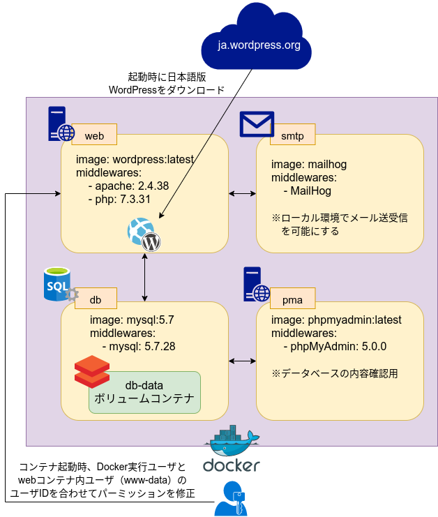

# 日本語版WordPress Docker

## Environment

- OS: Ubuntu 18.04
- Docker: 19.03.5
    - DockerCompose: 1.24.0

***

## Docker



### Structure
```bash
./
|_ docker/ # dockerコンテナビルド設定
|   |_ db/ # dbコンテナ
|   |   |_ dump/      # ダンプデータやりとり用ディレクトリ => docker://db:/var/dump/
|   |   |_ initdb.d/  # このディレクトリに配置したSQLファイルが初期データとして流し込まれる
|   |   |_ Dockerfile # dbコンテナビルド設定
|   |   |_ my.cnf     # MySQLデータベースの設定ファイル
|   |
|   |_ web/ # webコンテナ
|       |_ Dockerfile       # webコンテナビルド設定
|       |_ Dockerfile.php56 # php 5.6 を使う場合の webコンテナビルド設定
|       |_ 000-default.conf # Apache設定ファイル
|       |_ php.ini          # PHP設定ファイル
|
|_ www/ # 作業ディレクトリ => docker://web:/var/www/ にマウントされる
|   |_ html/         # ドキュメントルート
|   |_ setup.sh      # WordPress セットアップ + Apache 起動スクリプト: docker-compose up 時に毎回実行される
|   |_ wp-config.php # WordPress セットアップ時にコピーされる設定ファイル
|
|_ docker-compose.yml # webコンテナ <= php:7.3-apache
                      ## - Apache + PHP WEBサーバ
                      ## - http://localhost:1000 = https://web.local/ => docker://web:80
                      # dbコンテナ <= mysql:5.7
                      ## ┗ db-dataボリュームコンテナ
                      ## - DBサーバ: docker://db:3306
                      ## - ./docker/db/initdb.d/*.sql ファイルを初期投入データとして処理可能
                      # pmaコンテナ <= phpmyadmin/phpmyadmin:latest
                      ## - dbコンテナ内データ確認用 phpMyAdmin
                      ## - http://localhost:2000 = https://pma.web.local/ => docker://pma:80
                      # smtpコンテナ <= mailhog/mailhog
                      ## - ローカルSMTPサーバ: http://localhost:4000 => docker://smtp:1025
                      ## - メール確認: http://localhost:3000 = https://mail.web.local/ => docker://smtp:8025
                      # nginx-proxyコンテナ <= jwilder/nginx-proxy
                      ## - VirtualHost振り分け用ロードバランサコンテナ
                      ## - port 80, 443 を占有するため、使う場合は注意
                      # letsencryptコンテナ <= jrcs/letsencrypt-nginx-proxy-companion
                      ## - SSL証明書発行コンテナ
```

### vhosts
nginx-proxy (+ letsencrypt) コンテナを使って VirtualHost を有効化する場合は、以下のドメイン設定を `hosts` に記述

- **web.local** => `127.0.0.1`
- **pma.web.local** => `127.0.0.1`
- **mail.web.local** => `127.0.0.1`

### Environment
`docker-compose.yml` で設定できる環境変数は以下の通り

- **web.environment**
    - `WORDPRESS_DB_HOST`:
        - 接続先データベースホスト名（デフォルト: `localhost`）
        - dbコンテナを指定する（`db:3306`）
    - `WORDPRESS_DB_USER`:
        - 接続先データベースユーザ名（デフォルト: `root`）
        - dbコンテナの `MYSQL_USER` 環境変数を指定する
    - `WORDPRESS_DB_PASSWORD`:
        - 接続先データベースパスワード（デフォルト: `root`）
        - dbコンテナの `MYSQL_PASSWORD` 環境変数を指定する
    - `WORDPRESS_DB_NAME`:
        - 接続先データベース名（デフォルト: `wordpress`）
        - dbコンテナの `MYSQL_DATABASE` 環境変数を指定する
    - `WORDPRESS_DB_CHARSET`:
        - 接続先データベースの文字コード（デフォルト: `utf8mb4`）
    - `WORDPRESS_DB_COLLATE`:
        - 接続先データベースの照合順序（デフォルト: `utf8mb4_general_ci`）
    - `WORDPRESS_DB_PREFIX`:
        - WordPress テーブルの接頭辞（デフォルト: `wp_`）
    - `WORDPRESS_DEBUG`:
        - WordPressをデバッグモードにするかどうか（デフォルト: `false`）
        - 開発時は `true` にしておくと開発しやすい
- **db.environment**
    - `MYSQL_ROOT_PASSWORD`:
        - データベースのrootユーザパスワード
    - `MYSQL_USER`:
        - rootユーザ以外のユーザでデータベースを使う場合に指定
    - `MYSQL_PASSWORD`:
        - `MYSQL_USER` で指定したユーザのパスワード
    - `MYSQL_DATABASE`:
        - 使用するデータベース名

### Setup
```bash
# webコンテナ内の作業ユーザ（www-data）とDocker実行ユーザのUIDを合わせてコンテナビルド
$ export UID && docker-compose build

# コンテナをバックグラウンドで起動
## 起動時、setup.sh が WordPress のインストールと Apache の起動を行う
$ export UID && docker-compose up -d
```

コンテナが起動したら http://localhost:1000/cms/ にアクセスするとWordPressが使える
