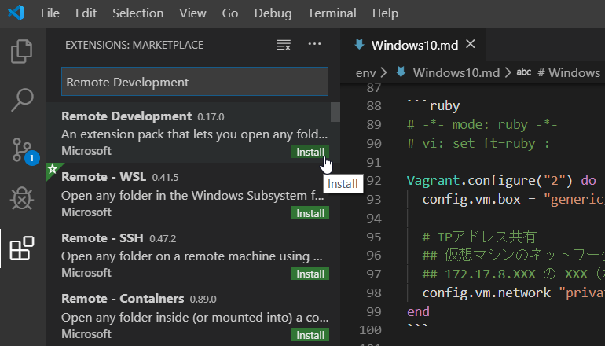
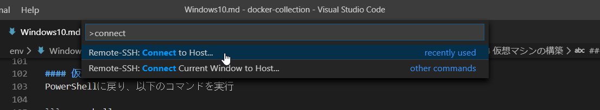
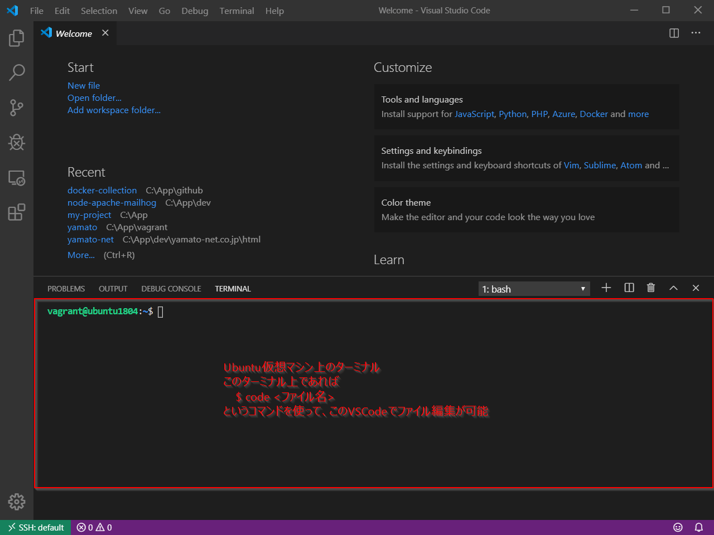

# Windows 10 環境構築

## VSCode インストール

[公式ページ](https://azure.microsoft.com/ja-jp/products/visual-studio-code/) からダウンロードしてインストールする

インストール時は、以下の項目にチェックを入れておくことを推奨

- [x] エクスプローラーのファイルコンテキストメニューに【Codeで開く】アクションを追加する
- [x] エクスプローラーのディレクトリコンテキストメニューに【Codeで開く】アクションを追加する
- [x] サポートされているファイルの種類のエディターとして、Codeを登録する
- [x] PATHへの追加（再起動後に使用可能）

***

## Windows上でのUbuntu環境構築

基本的にWeb開発は、WindowsよりLinux環境の方が効率的に開発ができる

Linuxの中でもUbuntuディストリビューションが、筆者のメイン開発環境であるため、ここではWindows上にUbuntu環境を構築していく

（なお、デュアルブート環境が構築できるのであれば、直接UbuntuOSをインストールした方が便利ではある）

Windows上にUbuntu環境を構築する手法としては大きく以下の2つがある

- WSL2 に Ubuntu ディストロパッケージを載せる
    - Windows Subsystem for Linux (WSL) のバージョン2 であれば、Dockerコンテナを用いたWeb開発も可能であり、動作も軽量なためおすすめ
    - ただし、ローカル環境でのSSL通信（https化）などができないため、現時点では VirtualBox + Vagrant 環境を推奨
    - Read [WSL2.md](./WSL2.md).
- VirtualBox + Vagrant 環境に Ubuntu 仮想環境を構築する
    - ホスト型仮想環境である VirtualBox に UbuntuOS をインストールして、Ubuntu仮想マシンを構築する方法
    - Vagrant という仮想マシン構成ツールを用いることで、簡単に仮想マシンを構築することができる
    - OSの中にOSを入れるような構成となるため、比較的高いマシンスペックが要求されるが、現在のWeb開発の主流となっている方法である

ここでは、後者の環境構築手順を記す

### VirtualBox, Vagrant のインストール
公式ページからインストーラをダウンロードしてきても良いが、ここでは Chocolatey（Windows用パッケージマネージャ）を使った方法を採用する

`Win + X` |> `A` キー => 管理者権限PowerShell 起動

```powershell
# Chocolatey 導入
> Set-ExecutionPolicy Bypass -Scope Process -Force; iex ((New-Object System.Net.WebClient).DownloadString('https://chocolatey.org/install.ps1'))

# Chocolatey バージョン確認
> choco -v
0.10.15

# VirtualBox, Vagrant インストール
> choco install -y virtualbox vagrant

# シンボリックリンクを有効化
> fsutil behavior set SymlinkEvaluation L2L:1 R2R:1 L2R:1 R2L:1

# コンピュータの再起動が必要なので、再起動する
> Restart-Computer

# 再起動が完了したら Vagrantプラグインをインストール
## Windowsホスト側と仮想マシン側のファイル共有のマウント問題等を解決するためのプラグインを導入
> vagrant plugin install vagrant-vbguest
> vagrant plugin install vagrant-winnfsd
> vagrant plugin install vagrant-ignition
```

### Ubuntu 18.04 仮想マシンの構築
Dockerコンテナを用いたWeb開発の最近のトレンドでは、仮想マシンとして、Docker特化Linuxである CoreOS を採用することが多い

しかしここでは、筆者のメイン開発環境である Ubuntu 18.04 を採用する

`Win + X` |> `A` キー => 管理者権限PowerShell 起動

```powershell
# 仮想マシンを構築するディレクトリを作成
## ここでは ユーザフォルダ/vagrant/ubuntu1804/ をプロジェクトディレクトリとする
> mkdir ~\vagrant\ubuntu1804

# プロジェクトディレクトリに移動
> cd ~\vagrant\ubuntu1804

# `Vagrantfile` というファイルを作成し、VSCode で編集
> code Vagrantfile
```

#### Vagrantfile
`Vagrantfile`とは、仮想マシンの構成・設定を記述するファイルであり、ここに使用するOSや共有フォルダ等を記述する

```ruby
# -*- mode: ruby -*-
# vi: set ft=ruby :

Vagrant.configure("2") do |config|
  config.vm.box = "generic/ubuntu1804" # Boxイメージ（仮想OS）: Ubuntu 18.04 を指定
  
  # IPアドレス共有
  ## 仮想マシンのネットワークとWindowsホスト側のネットワークを接続する
  ## 172.17.8.XXX の XXX（ホスト部）は重複しない任意の値を指定する（ここでは 100 を指定）
  config.vm.network "private_network", ip: "172.17.8.100"
end
```

#### 仮想マシン起動
PowerShellに戻り、以下のコマンドを実行

```powershell
# Vagrantfile の内容に基づいて仮想マシン起動
> vagrant up

## => 初回起動時はBoxイメージのダウンロードに時間がかかるため、しばらく待つ
```

起動した仮想マシンは、リモートサーバと同じような扱いになるため、サーバIPアドレス（Vagrantfile に設定した `17.17.8.100`）に SSH で接続して操作する必要がある

そのため、ファイルの編集等は、操作感がいまいちなターミナルエディタ（vim, nano など）を使って行う必要がある

しかし、VSCodeエディタにはこういったリモート開発をシームレスに行うための **Remote Development** プラグインがあるため、非常にWeb開発が行いやすくなっている

#### VSCode Remote Development プラグインの導入
VSCodeを起動し、`Shift + Ctrl + X` キーを押してプラグイン検索窓を開く

`Remote Development` で検索し、プラグインをインストールする



#### 仮想マシンへのアクセス
PowerShell に戻り、仮想マシンのSSH接続情報を設定ファイルに書き出す

```powershell
# vagrant ssh-config |> 出力内容を ~\.ssh\config ファイルに書き込む
> vagrant ssh-config | Out-File -Append -Encoding utf8 ~\.ssh\config
```

上記コマンドで、仮想マシンへのSSH接続情報が、ホスト名 `default` で登録される

VSCode上で `Shift + Ctrl + P` キーを押してコマンドパレットを表示し、`connect`と打つと `Remote-SSH: Connect to Host...` というコマンドが出てくるはずなので、このコマンドを実行する



その後 `default` というホストを選択すると、仮想マシンに接続された状態のVSCodeが起動する

このVSCode上で `Shift + Ctrl + @` キーを押すと、Ubuntuのターミナルが起動するため、以降の操作はこのターミナル上で行う



#### 仮想マシン内ネットワークの設定
仮想マシン内の curl で https のURLからダウンロードしようとすると失敗する

そのため、仮想マシンのターミナルで以下のコマンドを実行し、SSL検証を無効化しておく

```bash
$ echo 'check-certificate=off' >> ~/.curlrc
```

#### 仮想マシンの停止
仮想マシンを停止する場合は、PowerShellで `vagrant halt` コマンドを実行する

***

## Docker環境構築

**Ubuntu 18.04 環境構築** の項参照
