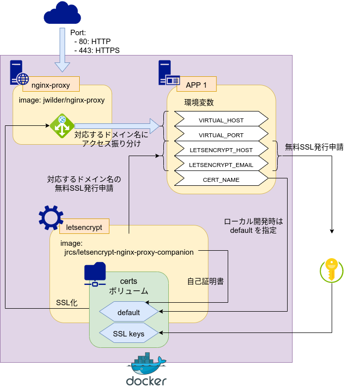

# https対応 localhost 開発

## nignx-proxy + letsencrypt-nginx-proxy-companion 構成



### jwilder/nginx-proxy
起動しているDockerコンテナを自動的に認識し、リクエストされたホスト名に紐付いているコンテナに上手いこと振り分けてくれるリバースプロキシサーバ

紐付けるホスト名は、環境変数 `VIRTUAL_HOST` で指定する

振り分け先のDockerコンテナは同一ネットワーク上で実行されている必要があるため、docker-compose.yml にネットワーク構築の設定を記述するか、`network_mode: bridge` でブリッジモード接続する必要がある

筆者の運用では、複数のDockerネットワークを使うことはないため、ブリッジモードを使っている

### letsencrypt-nginx-proxy-companion
上記 nginx-proxy コンテナと連動して、SSL証明書を自動的に取得してくれる Let's Encrypt コンテナ

これにより、面倒なSSL証明書発行の手間を省いて、https化することができる

環境変数 `LETSENCRYPT_HOST` が定義されているコンテナを見つけると Let's Encrypt 申請を行うため、ローカル開発時は `LETSENCRYPT_HOST` は使わない

代わりに `CERT_NAME` 環境変数に `default`（自己証明書｜オレオレ証明書）を指定する

***

## 構成

最も単純な PHP + Apache の構成は以下のようになる

```bash
./
|_ docker/ # Dockerコンテナビルド設定
|   |_ certs/ # SSL証明書格納ディレクトリ
|   |_ web/   # webコンテナ
|       |_ 000-default.conf # Apacheデフォルト設定
|       |_ php.ini          # PHP設定
|       |_ Dockerfile       # webコンテナビルドファイル
|
|_ www-data/ # Web公開ディレクトリ
|   |_ index.php
|
|_ docker-compose.yml # Docker構成
                      # nginx-proxyコンテナ: ホスト名に対応したコンテナに振り分けるリバースプロキシ
                      # letsencryptコンテナ: nginx-proxy と連動してホスト名をhttps化
                      # webコンテナ: php:7.3-apache | https://web.local/
```


***

## ローカル開発時のvhostsの設定

ローカル開発時は、開発環境ごとに仮想ドメイン（vhosts）を設定する

実運用時は、実際に買ったドメインをDNSサーバに設定するため、この操作は不要

### on Windows 10
管理者権限のメモ帳などで `C:\Windows\System32\drivers\etc\hosts` を編集

```ruby
# vhosts: web.local => 127.0.0.1
127.0.0.1  web.local
```

編集したら コマンドプロンプト or Powershell で以下を実行

```powershell
# DNSキャッシュをクリア
> ipconfig /flushdns
```

### on Ubuntu
```bash
# /vi/hosts を編集
$ sudo vi /etc/hosts

---
# vhosts: web.local => 127.0.0.1
127.0.0.1  web.local
---
```

***

## 動作確認

```bash
$ docker-compose build
$ docker-compose up -d
```

Dockerコンテナが起動したら https://web.local/ にアクセスして動作確認する
